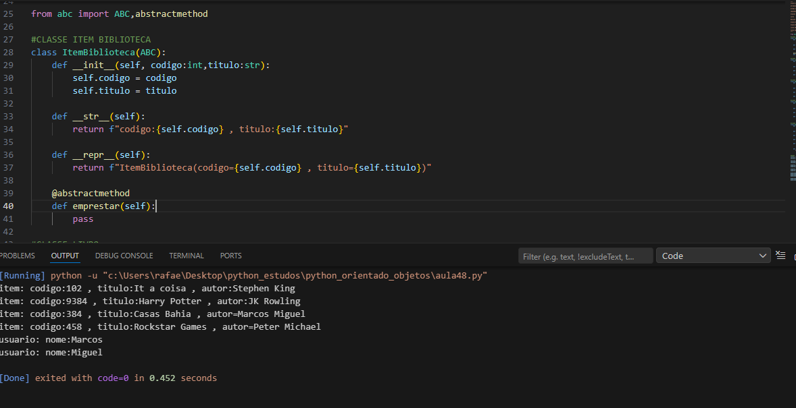

# Sistema de Biblioteca – Programação Orientada a Objetos em Python

Este repositório contém um projeto de estudo desenvolvido em Python com foco em Programação Orientada a Objetos (POO).  
O sistema simula o funcionamento básico de uma biblioteca e tem como principal objetivo reforçar conceitos fundamentais da linguagem e do paradigma orientado a objetos.




---

## Objetivo do Projeto

O projeto foi criado com fins educacionais para praticar e consolidar conhecimentos em POO, utilizando um domínio simples e realista: uma biblioteca.

Com ele, é possível compreender como modelar problemas do mundo real usando classes e objetos, além de aplicar boas práticas de organização de código.

---

## Conceitos Trabalhados

- Programação Orientada a Objetos
- Classes e objetos
- Encapsulamento
- Herança
- Classes abstratas (`ABC` e `@abstractmethod`)
- Métodos especiais (dunder methods):
  - `__init__`
  - `__str__`
  - `__repr__`
- Listas para gerenciamento de dados
- Separação de responsabilidades entre classes

---

## Estrutura do Sistema

O sistema é composto por classes que representam os principais elementos de uma biblioteca, como por exemplo:

- Livros
- Usuários / Clientes
- Biblioteca
- Regras de empréstimo e devolução

Cada classe possui métodos próprios e responsabilidades bem definidas, seguindo os princípios da Programação Orientada a Objetos.

---

## Execução do Projeto

1. Clone o repositório:
   ```bash
   git clone https://github.com/RafaelaDesousa33/sistema_biblioteca_orientacao_objetos.git
